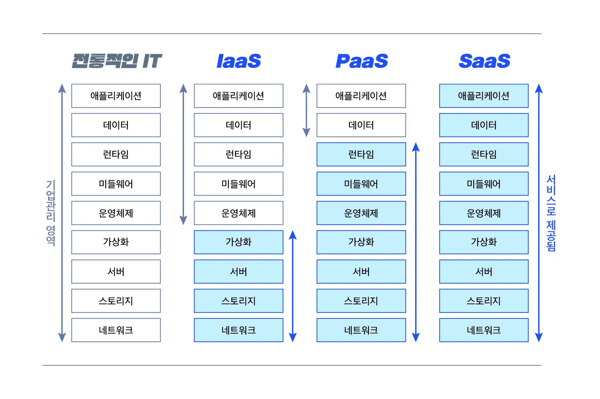

# [스터디 11주차] Elastic Beanstalk

- 주제 : 클라우드
- 일시 : 2022년 6월 30일 ~ 7월 28일

## Elastic Beanstalk 이란?

[PaaS | 응용 프로그램 관리 | Amazon Web Services](https://aws.amazon.com/ko/elasticbeanstalk/)

## IaaS, PaaS, SaaS

- IaaS : 서버, 스토리지 , 네트워크를 가상화 환경으로 만들어 필요에 따라 인프라 자원을 사용할 수 있게 제공하는 서비스입니다. (AWS, GCP, Azure, Vultr 등)
- PaaS : SaaS 개념을 개발 플랫폼으로 확장한 것으로, 웹에서 개발 플랫폼을 쉽게 빌려 쓸 수 있는 서비스입니다. (AWS Elastic Beanstalk, Google App Engine, Vercel, Netlify 등)
- SaaS : SaaS는 IaaS와 Paas 위에 올라가는 소프트웨어를 말하며, On-demand Software라고도 합니다. 중앙에서 호스팅되는 소프트웨어를 웹 브라우저 등 클라이언트로 이용하는 서비스입니다. (Google Docs, Dropbox 등)

## 애플리케이션과 환경

### 애플리케이션이란?

실행시킬 서비스 코드를 담아두고 관리하는 걸 애플리케이션이라고 함. 애플리케이션 안에는 여러 환경이 존재할 수 있다. 배포를 진행하면서 나오는 코드들을 버전별로 관리도 된다.

### 환경이란?

환경이란 애플리케이션을 실행할 수 있는 것으로, 서로 다른 버전의

## 직접 배포해보기

- 애플리케이션과 환경을 생성하여 샘플 애플리케이션을 만들어보자.
- 미리 만들어져있는 환경에서 어떤 것들을 만질 수 있는지 확인해보자.
- Code Pipeline을 이용해 Git에서 Commit을 하면 자동으로 배포되도록 구성해보자.
