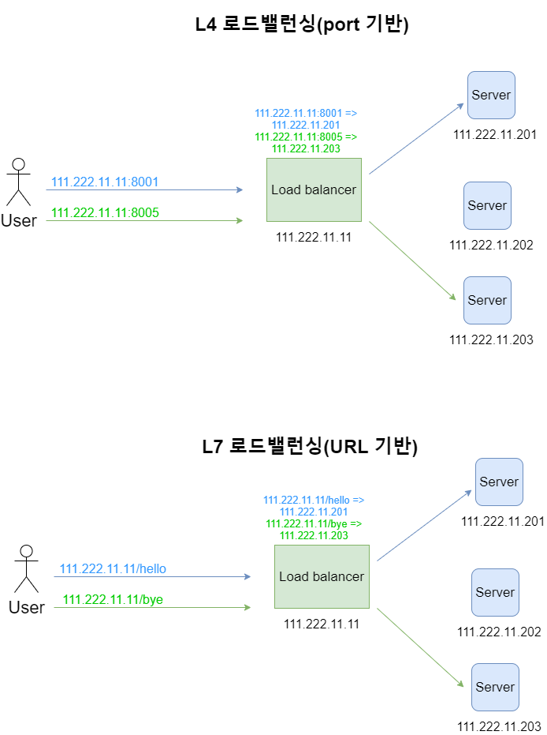
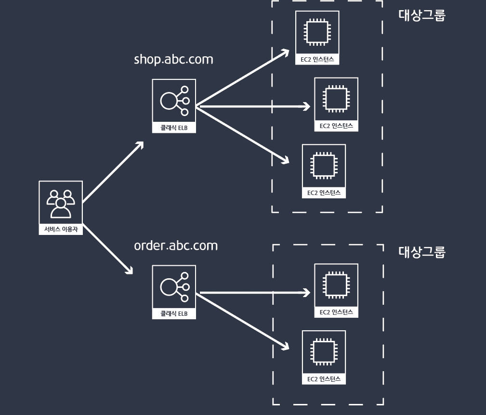
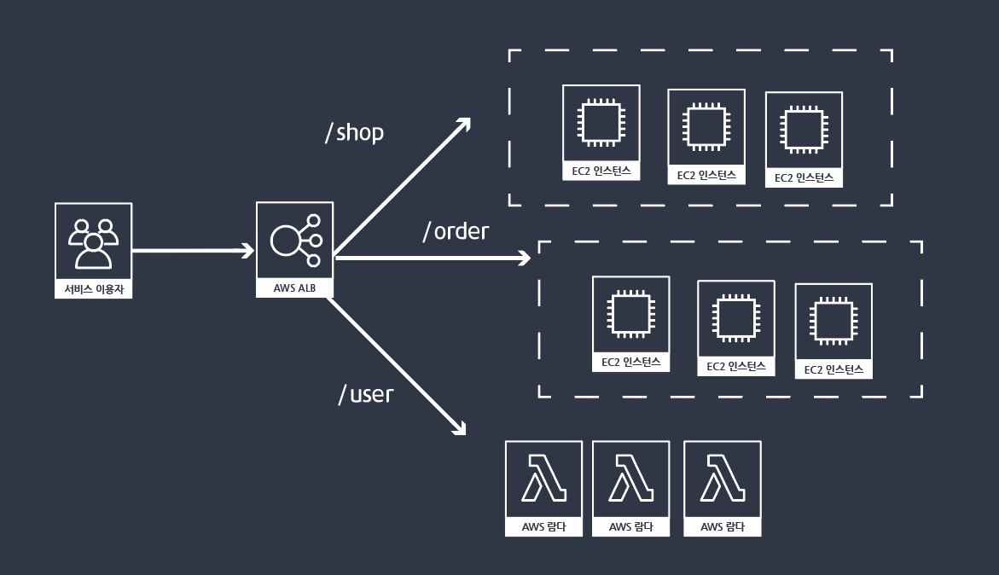

# [스터디 16주차] OSI 7계층과 로드밸런서

## OSI 7계층이란?

### Layer 1. Physical Layer (물리 계층)

이 계층에서는 주로 전기적, 기계적, 기능적인 특성을 이용해서 통신 케이블로 데이터를 전송하게 된다.

이 계층에서 사용되는 통신 단위는 비트이며 이것은 1과 0으로 나타내어지는, 즉 전기적으로 On, Off 상태라고 생각하면 된다.

이 계층에서는 단지 데이터를 전달만 할뿐 전송하려는(또는 받으려는)**데이터가 무엇인지, 어떤 에러가 있는지 등에는 전혀 신경 쓰지 않는다.**

단지 데이터 전기적인 신호로 변환해서 주고받는 기능만 할 뿐이다. 이 계층에 속하는 대표적인 장비는 **통신 케이블, 리피터, 허브**등이 있다.

→ **케이블, 리피터, 허브를 통해 데이터 전송한다.**

### Layer 2. DataLink Layer (데이터링크 계층)

물리계층을 통해 송수신되는 정보의 오류와 흐름을 관리하여 안전한 **정보의 전달을 수행**할 수 있도록 도와주는 역할을 한다.

따라서 통신에서의 오류도 찾아주고 재전송도 하는 기능을 가지고 있는 것이다.

이 계층에서는 **맥 주소를 가지고 통신**하게 된다.

이 계층에서 전송되는 단위를 프레임이라고 하고, 대표적인 장비로는 **브리지, 스위치** 등이 있다.(여기서 MAC주소를 사용한다.)

→ **브릿지나 스위치를 통해 맥주소를 가지고 물리계층에서 받은 정보를 전달함**.

### Layer 3. Network Layer (네트워크 계층)

이 계층에서 가장 중요한 기능은 **데이터를 목적지까지 가장 안전하고 빠르게 전달하는 기능(라우팅)**이다.

여기에 사용되는 프로토콜의 종류도 다양하고, 라우팅하는 기술도 다양하다.

이 계층은 경로를 선택하고 주소를 정하고 경로에 따라 패킷을 전달해주는 것이 이 계층의 역할이다.

이 계층의 대표적인 장비는 라우터 이며, 요즘은 2계층의 장비 중 스위치라는 장비에 라우팅 기능을 장착한 Layer 3 스위치도 있다.

(여기서 IP주소를 사용한다.)

네트워크 계층(Network layer)은 여러개의 노드를 거칠때마다 경로를 찾아주는 역할을 하는 계층으로

다양한 길이의 데이터를 네트워크들을 통해 전달하고, 그 과정에서 전송 계층이 요구하는 서비스 품질(QoS)을 제공하기 위한 기능적, 절차적 수단을 제공한다.

### Layer 4. Transport Layer (전송 계층)

통신을 활성화하기 위한 계층이다. 보통 TCP프로토콜을 이용하며, 포트를 열어서 응용프로그램들이 전송을 할 수 있게 한다.

만약 데이터가 왔다면 4계층에서 해당 데이터를 하나로 합쳐서 5계층에 던져 준다.

단대단 오류제어 및 흐름제어 이 계층 까지는 물리적인 계층에 속한다.(TCP/UDP프로토콜을 사용한다.)

전송 계층(Transport layer)은 양 끝단(End to end)의 사용자들이 신뢰성있는 데이터를 주고 받을 수 있도록 해 주어, 상위 계층들이 데이터 전달의 유효성이나 효율성을 생각하지 않도록 해준다.

시퀀스 넘버 기반의 오류 제어 방식을 사용한다.

전송 계층은 특정 연결의 유효성을 제어하고, 일부 프로토콜은 상태 개념이 있고(stateful),

**연결 기반(connection oriented)**이다.

이는 **전송 계층이 패킷들의 전송이 유효한지 확인하고 전송 실패한 패킷들을 다시 전송한다는 것**을 뜻한다.

가장 잘 알려진 전송 계층의 예는 TCP이다.

종단간(end-to-end) 통신을 다루는 최하위 계층으로 종단간 신뢰성 있고 효율적인 데이터를 전송하며, 기능은 오류검출 및 복구와 흐름제어, 중복검사 등을 수행한다.

→ **패킷 생성(Assembly/Sequencing/Deassembly/Error detection/Request repeat/Flow control) 및 전송**

### Layer 5. Session Layer (세션 계층)

**데이터가 통신하기 위한 논리적인 연결**을 말한다. 통신을 하기위한 대문이라고 보면 된다. 하지만 4계층에서도 연결을 맺고 종료할 수 있기 때문에 우리가 어느 계층에서 통신이 끊어 졌나 판단하기는 한계가 있다.

그러므로 세션 계층은 4 계층과 무관하게 응용 프로그램 관점에서 봐야 한다. 세션 설정, 유지, 종료, 전송 중단시 복구 등의 기능이 있다.

세션 계층(Session layer)은 양 끝단의 응용 프로세스가 통신을 관리하기 위한 방법을 제공한다. **동시 송수신 방식(duplex), 반이중 방식(half-duplex), 전이중 방식(Full Duplex)**의 통신과 함께, 체크 포인팅과 유휴, 종료, 다시 시작 과정 등을 수행한다.

이 계층은 **TCP/IP 세션을 만들고 없애는 책임**을 진다.

→ 통신하는 사용자들을 동기화하고 오류복구 명령들을 일괄적으로 다룬다.

→ 통신을 하기 위한 세션을 확립/유지/중단 (운영체제가 해줌)

### Layer 6. Presentation Layer (표현 계층)

데이터 표현이 상이한 응용 프로세스의 독립성을 제공하고, 암호화 한다.

표현 계층(Presentation layer)은 코드 간의 번역을 담당하여 사용자 시스템에서 데이터의 형식상 차이를 다루는 부담을 응용 계층으로부터 덜어 준다. MIME 인코딩이나 암호화 등의 동작이 이 계층에서 이루어진다.

예를 들면, EBCDIC로 인코딩된 문서 파일을 ASCII로 인코딩된 파일로 바꿔 주는 것, 해당 데이터가 TEXT인지, 그림인지, GIF인지 JPG인지의 구분 등이 표현 계층의 몫이다.

→ 사용자의 명령어를 완성및 결과 표현. 포장/압축/암호화

### Layer 7. Application Layer (응용 계층)

최종 목적지로서 HTTP, FTP, SMTP, POP3, IMAP, Telnet 등과 같은 프로토콜이 있다.

해당 통신 패킷들은 방금 나열한 프로토콜에 의해 모두 처리되며 우리가 사용하는 브라우저나, 메일 프로그램은 프로토콜을 보다 쉽게 사용하게 해주는 응용프로그램이다. 한마디로 모든 통신의 양 끝단은 HTTP와 같은 프로토콜이지 응용프로그램이 아니다.

응용 계층(Application layer)은 응용 프로세스와 직접 관계하여 일반적인 **응용 서비스를 수행**한다. 일반적인 응용 서비스는 관련된 응용 프로세스들 사이의 전환을 제공한다. 응용 서비스의 예로, 가상 터미널(예를 들어, **텔넷**), "Job transfer and Manipulation protocol" (JTM, 표준 ISO/IEC 8832) 등이 있다.

→ 네트워크 소프트웨어 UI 부분, 사용자의 입출력(I/O)부분

## 로드밸런서란?

### 로드밸런서의 종류

로드밸런서는 OSI 7계층을 기준으로 어떻게 부하를 분산하는지에 따라 종류가 나뉩니다. 2 계층을 기준으로 부하를 분산한다면 L2, 3 계층을 기준으로 부하를 분산한다면 L3인 방식입니다. 상위 계층으로 갈수록 섬세한 부하 분산이 가능하지만 가격이 비싸집니다. 하위 계층으로 갈수록 간단한 부하 분산이 가능하고 가격이 저렴해집니다.

| Layer | Description                                       |
| ----- | ------------------------------------------------- |
| L2    | Data link 계층을 사용, Mac주소 기반 부하 분산     |
| L3    | Network 계층을 사용, IP주소 기반 부하 분산        |
| L4    | Transport 계층을 사용, Port 기반 부하 분산        |
| L7    | Application 계층을 사용, 요청(URL) 기반 부하 분산 |

### 로드밸런서의 주요 기능

로드밸런서는 3가지의 주요 기능을 통해 로드밸런싱을 진행합니다.

- **Network Address Translation(NAT) :** Private IP를 Public IP로 바꿈
- **Tunneling :** 데이터를 캡슐화하여 연결된 노드만 캡슐을 해제할 수 있게 만듦
- **Dynamic Source Routing protocol(DSR) :** 요청에 대한 응답을 할 때 로드밸런서가 아닌 클라이언트의 IP로 응답

### 로드밸런서가 동작하는 방법

기초적인 방법인 Bridge/Transparent Mode에서는 사용자가 서버에 서비스를 요청할 때 중간에서 로드밸런서가 NAT를 통해 IP/MAC주소를 변조합니다. 즉 요청과 응답이 모두 Load Balancer를 경유합니다.

### 로드밸런서가 서버를 선택하는 방법

- **Round Robin** : 요청이 들어오는 대로 서버마다 균등하게 요청을 분배합니다. 가장 단순한 분배 방식입니다.
- **Weighted Round Robin Scheduling** : Round Robin방식으로 분배하지만 서버의 가중치에 따라 요청을 더 분배하기도, 덜 분배하기도 합니다. 서버 가중치는 사용자가 지정할 수 있고 동적으로 조정되기도 합니다.
- **Least Connection** : 서버마다 연결된 커넥션이 몇개인지 체크하여 커넥션이 가장 적은 서버로 요청을 분배하는 방식입니다.
- **Weighted Least Connections** : Least Connection방식으로 분배하지만 서버 가중치에 따라 요청을 더 분배하기도, 덜 분배하기도 합니다. 서버 가중치는 사용자가 지정할 수 있고 동적으로 조정되기도 합니다. 서버 풀에 존재하는 서버들의 사양이 일관적이지 않고 다양한 경우 이 방법이 효과적입니다.
- **Fastest Response Time** : 서버가 요청에 대해 응답하는 시간을 체크하여 가장 빠른 서버로 요청을 분배하는 방식입니다.
- **Source Hash Scheduling** : 사용자의 IP를 해싱한 후 그 결과에 따라 서버로 요청을 분배합니다. 사용자의 IP는 고정되어 있기 때문에 항상 같은 서버로 연결된다는 보장을 받을 수 있습니다.

## AWS 서비스 내에 있는 로드밸런서 서비스

### 클래식 로드밸런서 (ELB)

먼저 타겟그룹이란 EC2 인스턴스를 오토스케일링 할 수 있는 단위로 사용됩니다. 클래식 로드밸런서의 단점은 서버의 기본주소가 바뀌면 로드밸런서를 새로 생성해야하며 하나의 주소에 하나의 대상그룹으로 보내게됩니다. 또한 레이어 4계층에서 작동하기때문에 데이터를 수정, 변경할 수 없기때문에 포트나 헤더를 변경할 수 없습니다.

이러한 구조의 문제점은 서버의 구성이 비대해지고 마이크로 아키텍쳐를 구성하기 어렵습니다. 또한 회원모듈을 처리하는 인스턴스와 쇼핑모듈을 인스턴스가 따로 존재한다면 2개의 로드밸런서가 필요하고 비용도 2배로 들어가게됩니다.

### 애플리케이션 로드밸런서 (ALB)

반면 ALB는 패스나 포트등에 따라 다른 대상그룹으로 맵핑할 수 있습니다. 특히 포트단위로 연결해줄 수 있는것은 도커컨테이너 환경에서 아주 유용하게 작동할 수 있고 하나의 대상그룹에 더 많은 컨테이너를 넣어 비용을 최적화할 수 있습니다. 뿐만 아니라 대상을 EC2 인스턴스, 람다, IP로도 연결이 가능하며 특정한 요청에 대해서는 서버없이 직접 응답메세지를 작성할 수 있기때문에 마이크로아키텍쳐를 구성하기에 좋습니다.

## 자료 출처

- [https://shlee0882.tistory.com/110](https://shlee0882.tistory.com/110)
- [https://deveric.tistory.com/91](https://deveric.tistory.com/91)
- [https://medium.com/harrythegreat/aws-로드밸런싱-알아보기-9fd0955f859e](https://medium.com/harrythegreat/aws-%EB%A1%9C%EB%93%9C%EB%B0%B8%EB%9F%B0%EC%8B%B1-%EC%95%8C%EC%95%84%EB%B3%B4%EA%B8%B0-9fd0955f859e)
